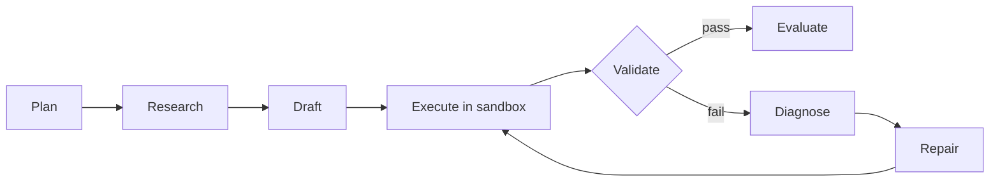
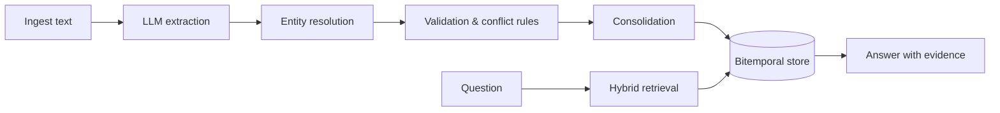
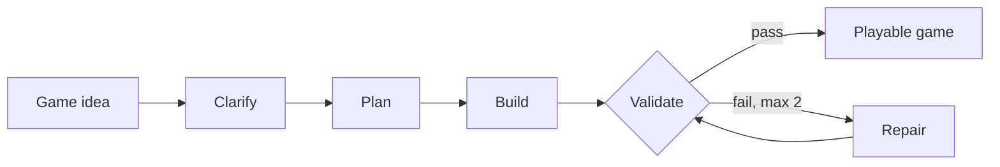

<h1 align="center">Hi, I'm Sameer Atram 👋</h1>

  

  
  
  

  <b>MTech CSE, IIT Hyderabad</b> · Hyderabad, India · Agentic AI Developer @ <b>Amgo Games</b>

---

## 👨‍💻 About me

I build **production-oriented LLM systems**: multi-agent workflows with LangGraph, hybrid retrieval pipelines, structured outputs, guardrails, and evaluation.
Currently building an agentic platform that turns natural-language game ideas into playable Three.js applications.

- 🤖 **Agentic AI:** multi-agent orchestration, plan → execute → validate → repair loops, tool/function calling
- 🧪 **Agent reliability:** sandboxed execution, failure attribution, evidence-first validation
- 🔎 **RAG & memory:** hybrid BM25 + dense retrieval, RRF, temporal and authority-aware agent memory
- 🛡️ **Reliable LLM systems:** JSON-Schema structured outputs, guardrails, CI/CD-integrated validation agents
- 📈 **LLM Ops:** OpenTelemetry tracing, latency / token / cost tracking, LangSmith, MLflow

---

## 🚀 Featured Projects

### 🧪 AgentEval: Multi-Agent Reliability & Evaluation Platform

  
  
  
  
  
  

> Most agent benchmarks report one success rate. AgentEval shows **where** a run went wrong, **why**, and whether it recovered.

- **Seven specialized agents** (planner, researcher, coder, executor, validator, failure analyzer, repairer) with a bounded repair loop
- **Ground truth from execution:** code runs in a locked-down Docker sandbox with CPU, memory and time limits and no network
- **Failure attribution:** rule-based classifier with LLM fallback tags every failure with a category, the responsible agent, and a fix
- **Full observability:** every step stored with output, latency and tokens, inspectable in a live Next.js dashboard
- **Multi-provider:** Anthropic, OpenAI, Gemini, DeepSeek, plus an offline fake provider for tests; fault injection and CI

---

### 🧠 Enterprise Engineering Memory Agent: Memory That Knows What's True *Now*

  
  
  
  
  
  

> A persistent memory layer for AI agents that tracks **what is true now, what was true before, and what to distrust**, and learns lessons from repeated failures.

| Benchmark (synthetic, held-out seeds) | Vector RAG | **Full memory** |
|---|---|---|
| Overall accuracy | 82% | **95%** |
| Current-fact questions | 58% | **100%** |
| Stale / poisoned answer rate (lower is better) | 43% | **14%** |

- **Bitemporal queries:** "what is true now", "what was true on date X", "when did it change"
- **Authority-aware:** production config outranks an agent's guess; poisoned claims never overwrite accepted facts and go to human review
- **Rigorous eval:** programmatic grading, no LLM judge, bootstrap confidence intervals, and limitations documented in the PoC report

---

### 🎮 Agentic Game Builder: From an Idea to a Playable Game

  
  
  
  
  
  

> Type a game idea in plain English and get a playable browser game (HTML + CSS + JS).

- **LangGraph state graph** with conditional routing for the clarification and repair loops
- **Clarifier** asks up to 3 targeted questions; **planner** outputs a structured JSON game plan
- **Validator** runs a 10-point static check plus an optional LLM semantic check; **repair agent** fixes only the broken parts
- **Live streaming UI:** FastAPI streams each phase over Server-Sent Events; CLI and Docker modes included

---

## 🛠️ Tech Stack

  

  
  
  
  
  
  
  
  
  
  

---

  <i>Open to Applied AI / GenAI Engineer roles, remote or relocation. Let's build agents that actually work. 🤝</i>

